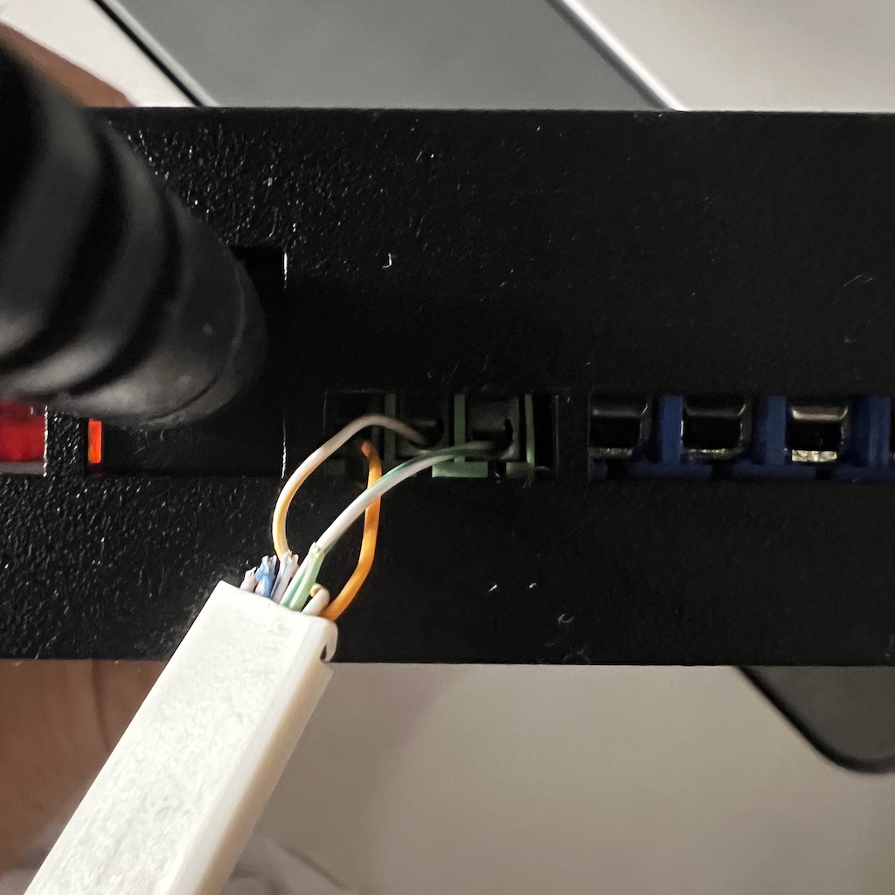

# Comfoair Q 350 MQTT bridge

This project lets you use the [Olimex ESP32-EVB](https://github.com/OLIMEX/ESP32-EVB) with CAN interface to interact with the Comfoair Q 350 ventilation unit. Tested with the Olimex ESP32-EVB-EA-IND.

- It exposes all known information and airflow control through MQTT
- It allows you to integrate the unit in Home Assistant as depicted below:
  

You can find the configuration YAML files in the `docs` folder.

Based on the original repo: https://github.com/vekexasia/comfoair-esp32

With changes merged in from the following forks:

- [https://github.com/mat3u/comfoair-esp32](https://github.com/mat3u/comfoair-esp32/tree/hacomfoairmqtt-compatibility)
- [https://github.com/hcouplet/comfoair-esp32](https://github.com/hcouplet/comfoair-esp32/tree/hacomfoairmqtt-compatibility)

## Components

- Olimex ESP32-EVB board
- 5V power supply adapter
- Any ethernet cable (RJ45 connector)
- A micro USB cable to connect the board to your computer

> updated MacOS driver for USB: https://github.com/WCHSoftGroup/ch34xser_macos

## How

### Software

1. Update `secrets.yaml` with your WiFi and MQTT credentials.
2. Build the image with [PlatformIO](https://platformio.org).
3. Upload/flash the firmware to the board.
4. Copy the Home Assistant configuration from `docs/home-assistant/packages/comfoair` to your Home Assistant installation (e.g. `/config/packages/comfoair`). Reload your YAML configuration.
   - For the ventilation card with the arrows, see `docs/home-assistant/example-picture-elements-card.yaml`

### Hardware

1. Strip one side of the ethernet cable
2. Connect the orange, white-orange, white-green wires to the ESP32-EVB board (see diagram + pictures below).
3. Connect the other side of the cable to the RJ45 port of the ventilation unit (located at the top, behind the sliding cover).

### Connection diagram

```

|----------------+                                    +---------------+
|                |                                    |               |
|   [ComfoAir]   |                                    |  [ESP32-EVB]  |
|                |                                    |               |
|                |        +++++++++++++++++++++       |               |
|           RJ45 o--------|   (orange)  CAN-H o-------o   CAN-TX D5   |
|----------------+        | (w/orange)  CAN-L o-------o   CAN-RX D35  |
                          |  (w/green)    GND o-------o GND           |
                          +++++++++++++++++++++       +---------------+
```

Here is a picture of the board in the case connected to the Zehnder ComfoAir Q

- 
- 

---

## MQTT commands

The following commands are available. just issue whatever payload you want to `${prefix}/commands/${key}`

where `${key}` is:

- ventilation_level_0
- ventilation_level_1
- ventilation_level_2
- ventilation_level_3
- boost_10_min
- boost_20_min
- boost_30_min
- boost_60_min
- boost_end
- auto
- manual
- bypass_activate_1h
- bypass_deactivate_1h
- bypass_auto
- ventilation_supply_only
- ventilation_supply_only_reset
- ventilation_extract_only
- ventilation_extract_only_reset
- ventilation_balance
- temp_profile_normal
- temp_profile_cool
- temp_profile_warm

Along with these above you can also use the `ventilation_level` key with the string `0` or `1`, `2`, `3` to set the desired fan speed level.
There is also `set_mode` which accepts `auto` or `manual` as payload.


## Olimex ESP32-EVB board vs ESP32

- ESP32-EVB connects to the RJ45 port on the ventilation unit
  - ESP32-EVB uses the CAN pin numbers GPIO_NUM_35 (CAN-RX) + GPIO_NUM_5 (CAN-TX) instead of GPIO_NUM_5 + GPIO_NUM_4
- CAN interface is built-in, so no need for soldering or additional hardware
- Requires a separate 5V power supply, whereas the ESP32 can be powered via the 12V supply of the ventilation unit (but separate power supply can be more reliable)
- Also, you can get a [metal box case](https://www.olimex.com/Products/IoT/ESP32/BOX-ESP32-EVB-EA/) from Olimex, so no need for 3D printing

Example ESP32 alternative (see [diagram](https://github.com/mat3u/comfoair-esp32/tree/hacomfoairmqtt-compatibility#connections-diagram))


## Changes to original project

> Compared to original project by `vekexasia`

### List of changes

> Some of these changes could be avoided by smarter configuration in HA, yet it was easier for me to change firmware rather than tinker with HA.

1. Some small refactors in C++ to avoid warnings or unpredicted side-effects.
2. `MQTT_PREFIX/status` topic - that shows whether device is online or offline, it uses last will feature of MQTT, to send offline message. This topic can have one of two possible values `online` or `offline`. This can be used to drive `availability_topic` in HA.
3. Number of topics is renamed, to follow more style of HA also new command topics are added
4. `MQTT_PREFIX/climate/fan[/set]` - status of fan (`off`, `low`, `medium` and `high`) and topic to set value from HA (same values). Please see [Climate](#climate).
5. `MQTT_PREFIX/climate/mode[/set]` - topic for operating mode (`auto` and `manual`). There is hack to force `auto` when `limited_manual` is active: `limited_manual` -> `manual` -> `auto` (otherwise status would be ignored).
6. `MQTT_PREFIX/climate/preset[/set]` - temperature profile (`warm`, `auto`, `cool`). I was unable to use this in HA from any existing UI components (automations and stuff works).
7. `operating_mode` -> `climate/mode`, and one value was renamed `unlimited_manual` -> `manual`
8. `fan_speed` -> `climate/fan`, and values changed from numerical to strings from point 2.
9. `temp_profile` -> `climate/preset` and as above.
10. Hostname added to network configuration, should be defined in `secrets.h` as `#define HOSTNAME "ca350_bridge"` (or any hostname you prefer).
11. I prepared bigger case as I had bigger ESP32 board (DoIt ESP32 DevKit v1) please find it in `./docs/3d`

> Other configuration is same as [sensors.yaml](./docs/haconfig/.sensors.yaml) with small renames.

## Credits

A lot of this repo was inspired by the reverse engineering [here](https://github.com/marco-hoyer/zcan/issues/1).
If you'd like to know more how the unit communicates, head over

- [here](https://github.com/michaelarnauts/comfoconnect/blob/master/PROTOCOL-RMI.md)
- [and here](https://github.com/michaelarnauts/comfoconnect/blob/master/PROTOCOL-PDO.md)

There's also a Node.JS version with a Raspberry PI [here](https://github.com/vekexasia/comfoairq-mqtt)
