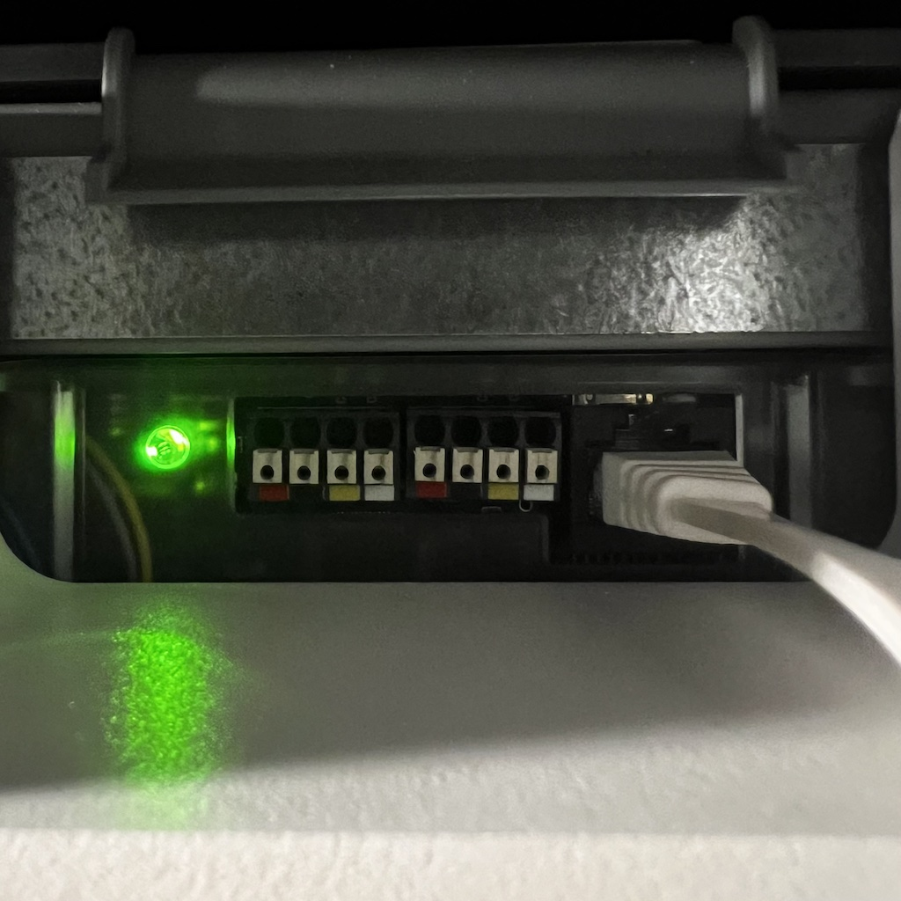
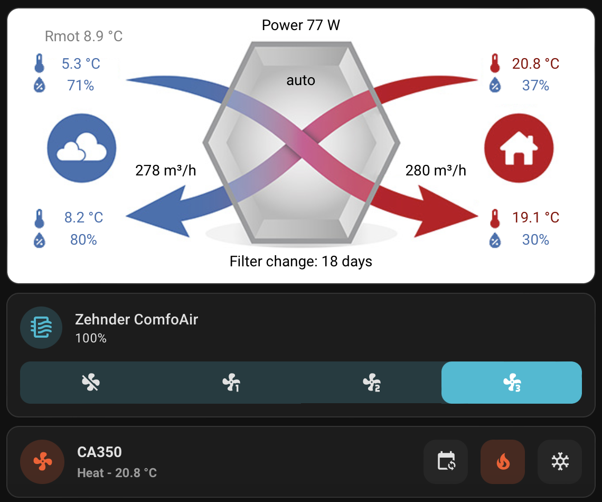

# HEADS UP

Check issue https://github.com/vekexasia/comfoair-esp32/issues/46 about the project direction and future changes to this repo.

This is another update based on olimex ESP32-EVB board :

https://www.olimex.com/Products/IoT/ESP32/ESP32-EVB/open-source-hardware

The advantage of that board is that it integrate wifi, network card and a CAN connection.
Also you can get a clean box from olimex :
https://www.olimex.com/Products/IoT/ESP32/BOX-ESP32-EVB-EA/

So you don't need to do soldery or 3D box,... the only things needed are the board and the case.

For the cable, use a standard network cable and connect orange, white-orange, white-green on the olimex (see picture)

Here is a picture of the board in the case connected to my Zehnder Comfoair q450.





---

# **This is slightly modified version of https://github.com/vekexasia/comfoair-esp32/ firmware for ESP32 that can talk with Comfoair Q350 (and compatible, eg. Aeris Next 350). Please read [Changes](#changes-to-original-project) section.**

# Comfoair Q 350 MQTT bridge

This software script let you use a ESP32 + CAN Transceiver to interact with the Comfoair Q 350 unit.

It does expose all known informations through MQTT and let you control the air flow via MQTT as well.

It does allow you to integrate the unit on Home Assistant as depicted below:


You can find the configuration YAML files in the `docs` folder.

## Changes to original project


### Connections diagram

Diagram below shows my version of connections.

```
---------------+        +---------------+                 +-------------+
(orange)  12V  o--------o IN+      OUT+ o-----------------o VIN         |
               |        |   [LM2596S]   |                 |             |
(brown)   GND  o--------o IN-      OUT- o-----------------o GND         |
               |        +---------------+                 |             |
    [RJ45]     |                                          |   [ESP32]   |
  [Keystone]   |                                          | [DevKit V1] |
               |        +-------------------------+       |             |
(w/blue) CAN_L o--------o CAN_L               3v3 o-------o 3v3         |
(blue)   CAN_H o--------o CAN_H               GND o-------o GND         |
---------------+        |                         |       |             |
                        |   [SN65HVD230]   CAN TX o-------o D5          |
                        |                  CAN RX o-------o D4          |
                        +-------------------------+       +-------------+
```

### List of changes

> Some of these changes could be avoided by smarter configuration in HA, yet it was easier for me to change firmware rather than tinker with HA.

1. Some small refactors in C++ to avoid warnings or unpredicted side-effects.
2. `MQTT_PREFIX/status` topic - that shows whether device is online or offline, it uses last will feature of MQTT, to send offline message. This topic can have one of two possible values `online` or `offline`. This can be used to drive `availability_topic` in HA.
3. Number of topics is renamed, to follow more style of HA also new command topics are added
4. `MQTT_PREFIX/climate/fan[/set]` - status of fan (`off`, `low`, `medium` and `high`) and topic to set value from HA (same values). Please see [Climate](#climate).
5. `MQTT_PREFIX/climate/mode[/set]` - topic for operating mode (`auto` and `manual`). There is hack to force `auto` when `limited_manual` is active: `limited_manual` -> `manual` -> `auto` (otherwise status would be ignored).
6. `MQTT_PREFIX/climate/preset[/set]` - temperature profile (`warm`, `auto`, `cool`). I was unable to use this in HA from any existing UI components (automations and stuff works).
7. `operating_mode` -> `climate/mode`, and one value was renamed `unlimited_manual` -> `manual`
8. `fan_speed` -> `climate/fan`, and values changed from numerical to strings from point 2.
9. `temp_profile` -> `climate/preset` and as above.
10. Hostname added to network configuration, should be defined in `secrets.h` as `#define HOSTNAME "ca350_bridge"` (or any hostname you prefer).
11. I prepared bigger case as I had bigger ESP32 board (DoIt ESP32 DevKit v1) please find it in `./docs/3d`

### Climate

> This configuration is in progress, as HA has hard times handling non-typical modes and presets.

```yaml
- name: "CA350"
  unique_id: "CA350"
  icon: mdi:fan
  availability:
    topic: "comfoair/status"
  current_temperature_topic: "comfoair/post_heater_temp_after"
  temperature_state_topic: "comfoair/target_temp"
  fan_mode_command_topic: "comfoair/climate/fan/set"
  fan_mode_state_topic: "comfoair/climate/fan"
  fan_modes:
    - off
    - low
    - medium
    - high
  mode_command_topic: "comfoair/climate/mode/set"
  mode_state_topic: "comfoair/climate/mode"
  modes:
    - auto
    - limited_manual
    - manual
  preset_mode_command_topic: "comfoair/climate/preset/set"
  preset_mode_state_topic: "comfoair/climate/preset"
  preset_modes:
    - auto
    - cool
    - warm
  min_temp: 17
  max_temp: 27
```

and this can be used with [lovelace-hacomfoairmqtt](https://github.com/mweimerskirch/lovelace-hacomfoairmqtt) and should look like this:


> As you may see, 4 icons on top are not working, I am still working on binary sensors.

Configuration of Lovelace control:

```yaml
type: custom:hacomfoairmqtt-card
climateEntity: climate.ca350
outsideTempSensor: sensor.ca350_outdoor_air_temperature
exhaustTempSensor: sensor.ca350_exhaust_air_temperature
returnTempSensor: sensor.ca350_extract_air_temperature
supplyTempSensor: sensor.ca350_post_heater_temp_after
returnAirLevelSensor: sensor.ca350_exhaust_fan_duty
supplyAirLevelSensor: sensor.ca350_supply_fan_duty
```

> Other configuration is same as [sensors.yaml](./docs/haconfig/.sensors.yaml) with small renames.

## Components

Provided you've the necessary hardware, you need to create the `.env` file based on the `.env-sample` file with the proper environment variables.

Prerequisites:

- `ESP32` -> [link](https://amzn.to/3pe0XVP)
- `DC-DC converter` -> [link](https://amzn.to/39ar22v)
- `RJ45 Female` -> [link](https://amzn.to/3sNx3tH)
- `Can Transceiver` -> [Waveshare SN65HVD230](https://www.banggood.com/Waveshare-SN65HVD230-CAN-Bus-Module-Communication-CAN-Bus-Transceiver-Development-Board-p-1693712.html?rmmds=myorder&cur_warehouse=CN)

* Some ethernet cable

## How

1.  Buy Type B cabled Some ethernet Cable:

2.  Cut the cable and use

    - RJ45 White/Brown -> black in VMC
    - RJ45 Brown -> Red in VMC
    - RJ45 green -> white in VMC (CAN_L)
    - RJ45 orange -> yellow in VMC (CAN_H)

3.  Cable RJ45 Female

- Green and Orange to CAN_L and CAN_H of transceiver
- Whtie/Brown to DC-DC `IN-`
- Brown to DC-DC `IN+`

3. Connect trasceiver

- can_rx -> pin 5 of esp32
- can_tx -> pin 4 of esp32
- gnd + vcc to DC-DC OUT pins

4. Connect ESP32 to DC-DC out pins and transceiver (as prev step).
5. Print the Fusion 3D file provided in `docs/3d` folder

The end result should look like this:


## MQTT commands

The following commands are available. just issue whatever payload you want to `${prefix}/commands/${key}`

where `${key}` is:

- ventilation_level_0
- ventilation_level_1
- ventilation_level_2
- ventilation_level_3
- boost_10_min
- boost_20_min
- boost_30_min
- boost_60_min
- boost_end
- auto
- manual
- bypass_activate_1h
- bypass_deactivate_1h
- bypass_auto
- ventilation_supply_only
- ventilation_supply_only_reset
- ventilation_extract_only
- ventilation_extract_only_reset
- ventilation_balance
- temp_profile_normal
- temp_profile_cool
- temp_profile_warm

Along with these above you can also use the `ventilation_level` key with the string `0` or `1`, `2`, `3` to set the desired fan speed level.
There is also `set_mode` which accepts `auto` or `manual` as payload.

## Credits

A lot of this repo was inspired by the reverse engineering [here](https://github.com/marco-hoyer/zcan/issues/1).
If you'd like to know more how the unit communicates, head over

- [here](https://github.com/michaelarnauts/comfoconnect/blob/master/PROTOCOL-RMI.md)
- [and here](https://github.com/michaelarnauts/comfoconnect/blob/master/PROTOCOL-PDO.md)

There's also a Node.JS version with a Raspberry PI [here](https://github.com/vekexasia/comfoairq-mqtt)
